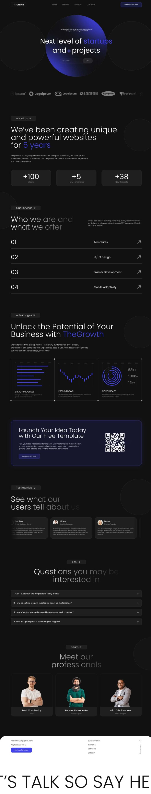
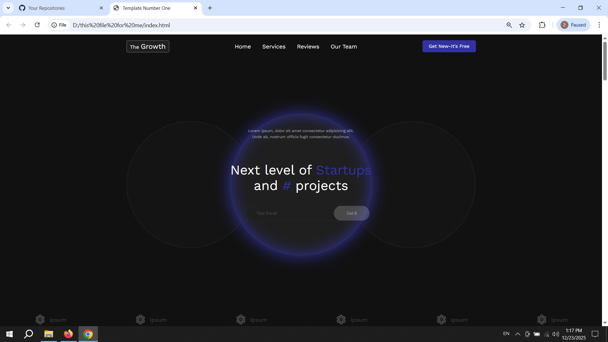
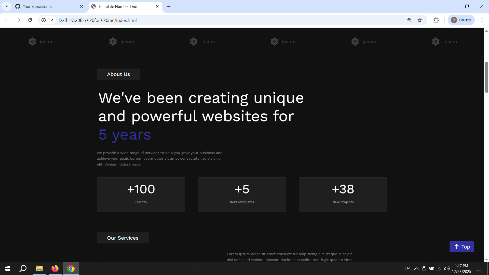
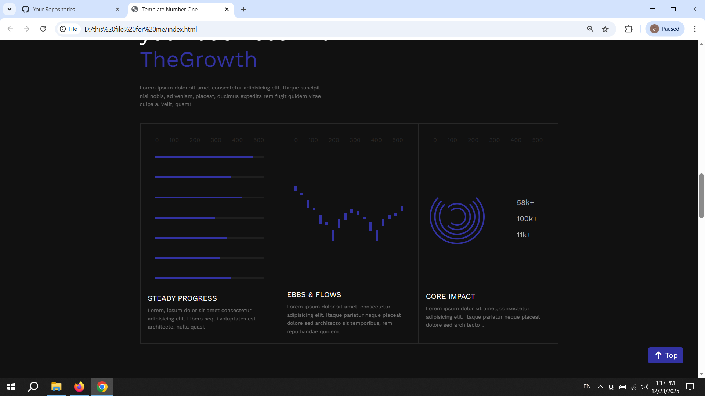
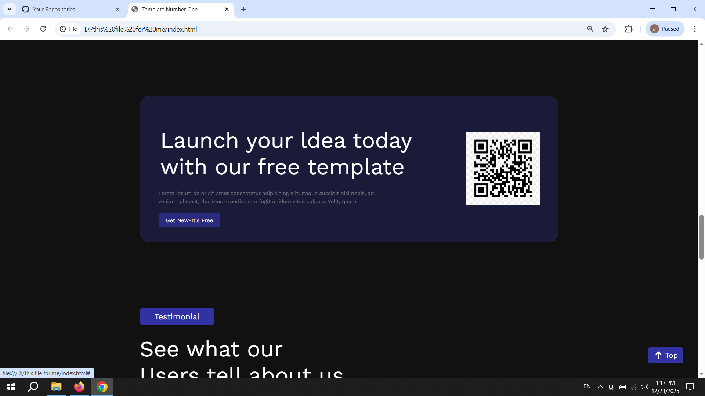
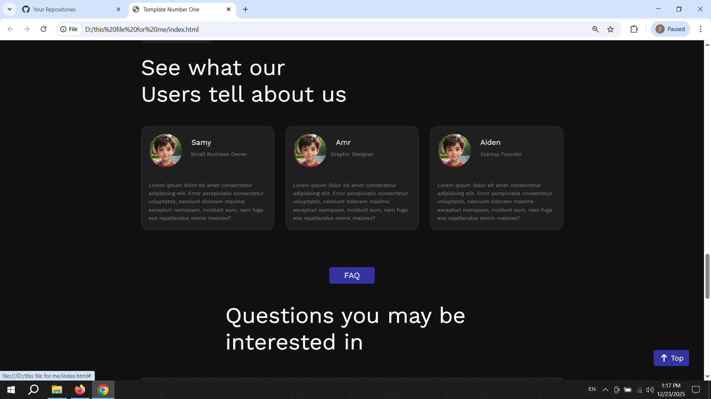
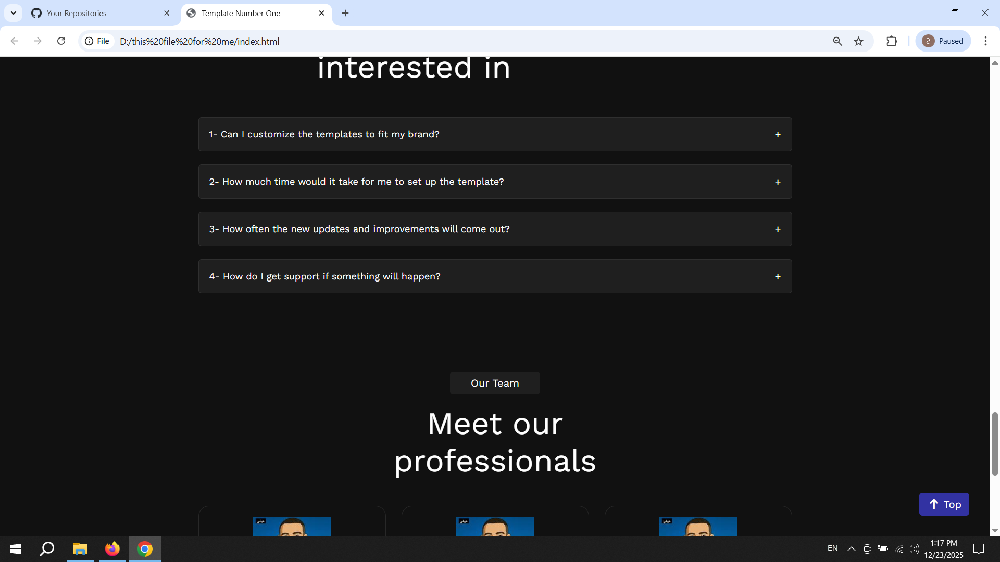
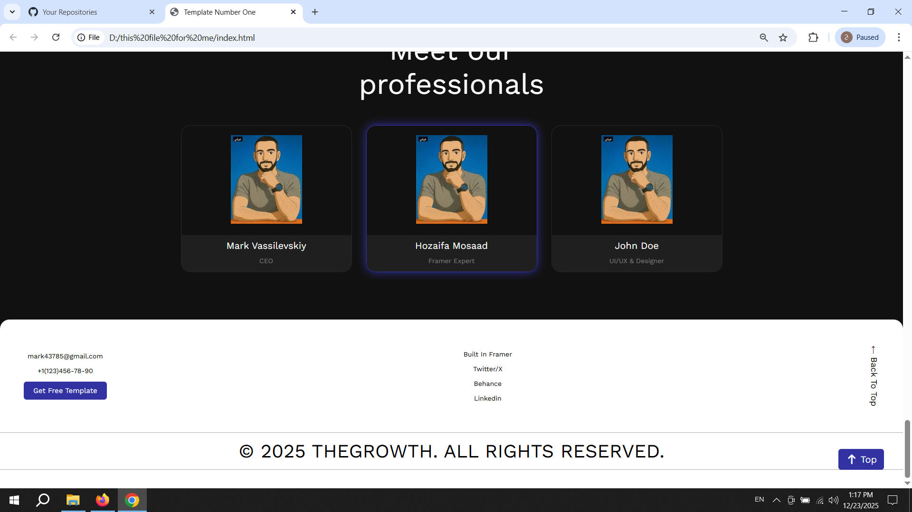

# 🚀 Modern SaaS Landing Page - The Growth
A professional, fully responsive landing page built from scratch using HTML5 and CSS3. This project demonstrates high-level skills in converting complex designs into clean, functional code.

## 🚀 Key Features
* **Custom Built:** Developed entirely from scratch without using frameworks.
* **Responsive Design:** Optimized for all screen sizes (Mobile, Tablet, Desktop) using Media Queries.
* **Smooth Navigation:** Features a "Back to Top" button with smooth scrolling functionality.
* **Modern UI:** Implemented professional typography (Work Sans) and a dark-themed aesthetic.

## 📸 Project Showcase

### 🎨 Design Inspiration
This is the original design I followed to build the project:

### 💻 My Implementation (Screenshots)
Below are the screenshots of the final coded version:

## 🛠️ Tech Stack
* **HTML5:** Semantic markup for better SEO and accessibility.
* **CSS3:** Custom variables, Flexbox, and complex layouts.
* **JavaScript:** Used for the interactive "Scroll to Top" button behavior.

---
**Designed & Developed with ❤️ by [Your Name]**
